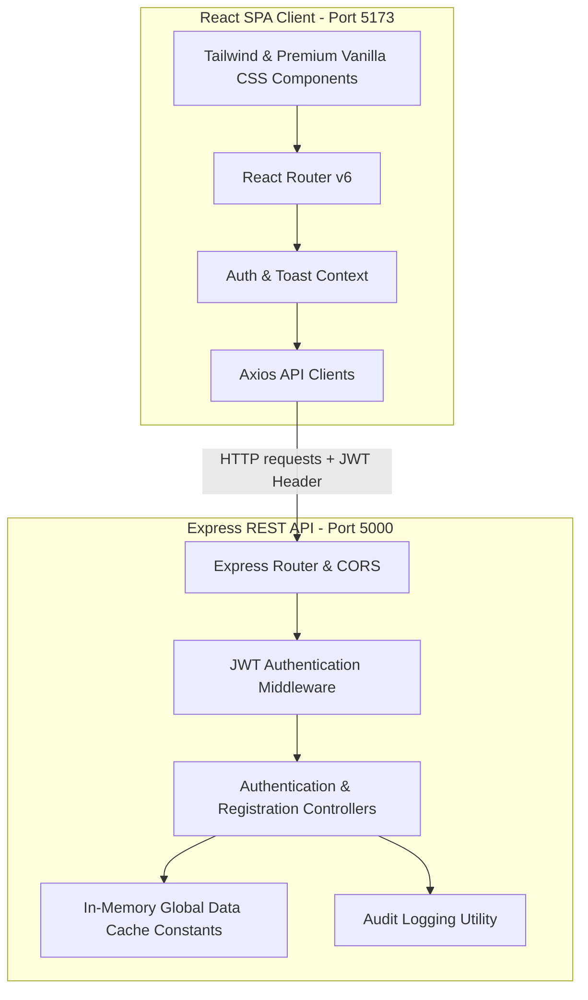

# PerformanceIQ — Technical Solution Document

This document provides a deep-dive technical overview of the architecture, directory structure, data models, API endpoints, and step-by-step feature workflows implemented in **PerformanceIQ**.

---

## 1. Architectural Summary

PerformanceIQ is built using a modern decoupled client-server architecture:



### Technical Stack
* **Frontend**: React (v18), Vite, React Router v6, TailwindCSS, Axios (singleton instance with request/response interceptors), Context API.
* **Backend**: Node.js, Express, JSON Web Tokens (JWT), Nodemon, CORS.

---

## 2. Directory Structure Walkthrough

```text
goal-portal-full/
├── README.md                 # Evaluation criteria mapping document
├── SOLUTION.md               # Detailed technical solution document (this file)
└── gp/
    ├── client/               # Frontend single-page application
    │   ├── src/
    │   │   ├── components/   # UI components (Loader, Toast, Button)
    │   │   ├── constants/    # Corporate constants and routes
    │   │   ├── hooks/        # custom React Hooks (useAuth)
    │   │   ├── pages/        # Main pages (LoginPage, Dashboards)
    │   │   ├── services/     # Axios client configurations and API classes
    │   │   ├── index.css     # Global resets & Inter typography settings
    │   │   └── main.jsx      # React entrypoint
    │   ├── index.html        # HTML layout, Google Fonts & CDN Icon styling
    │   ├── vite.config.js    # Bundler config
    │   └── package.json
    └── server/               # Node.js Express Backend
        ├── config/           # Enums, constraints, and hardcoded demo users
        ├── controllers/      # Route handlers (auth, login, registration)
        ├── middleware/       # JWT validators, CORS controls, and error handlers
        ├── routes/           # REST endpoints
        ├── utils/            # Audit logger, response helpers
        ├── app.js            # Express app assembly & middleware pipeline
        ├── server.js         # Port bindings & startup listeners
        └── package.json
```

---

## 3. Data Models & Memory Store

For ultra-high performance and instant feedback, the system operates on a stateful, in-memory data store located in `gp/server/config/constants.js`. 

### A. User Data Model
```typescript
interface User {
  id: string;          // Format: 'usr_xxx'
  email: string;       // Corporate unique email
  password: string;    // Auth secret (plaintext for demo capability)
  name: string;        // Full corporate name
  role: 'employee' | 'manager' | 'admin';
  managerId: string | null;  // Direct reporting line reference
  department: string;  // e.g. 'Engineering', 'HR'
}
```

### B. Goal Data Model
```typescript
interface Goal {
  id: string;          // Format: 'goal_xxx'
  userId: string;      // Authoring employee ID
  title: string;       // Goal name
  description: string; // Key details
  weightage: number;   // Weight percentage (10% to 100%)
  status: 'Draft' | 'Submitted' | 'Approved' | 'Rework Requested' | 'Locked';
  feedback: string | null; // Manager review notes
  quarter: string;     // e.g. 'Q1', 'Q2'
}
```

### C. Audit Log Model
```typescript
interface AuditLog {
  id: string;          // Unique audit ID
  timestamp: string;   // ISO-8601 string
  action: 'USER_LOGIN' | 'USER_LOGOUT' | 'GOAL_CREATE' | 'GOAL_SUBMIT' | 'GOAL_APPROVE' | 'GOAL_REWORK';
  performedBy: string; // User ID
  performedByName: string; // User Name
  targetId: string;    // Related entity ID
  entityType: string;  // e.g., 'user', 'goal'
  newValue: object | null; // Details of state transition
}
```

---

## 4. API Endpoint Specifications

All endpoints are prefixed with `/api`. Public routes require no headers; protected routes require a `Authorization: Bearer <JWT_TOKEN>` header.

| Endpoint | Method | Security | Description |
|---|---|---|---|
| `/auth/login` | `POST` | Public | Authenticates user credentials, registers log, returns JWT + User profile |
| `/auth/register` | `POST` | Public | Validates details, checks email conflicts, saves user in-memory, returns profile |
| `/auth/me` | `GET` | Protected | Authenticates token, rehydrates state, returns decrypted user profile |
| `/auth/logout` | `POST` | Protected | Validates current token, creates audit trail log, returns success |

### Sample Payload: POST `/api/auth/register`
* **Request**:
  ```json
  {
    "name": "Jane Doe",
    "email": "jane.doe@company.com",
    "password": "strongPassword123",
    "role": "employee",
    "department": "Engineering"
  }
  ```
* **Success Response (201 Created)**:
  ```json
  {
    "success": true,
    "message": "Registration successful! You can now log in.",
    "data": {
      "user": {
        "id": "usr_004",
        "email": "jane.doe@company.com",
        "name": "Jane Doe",
        "role": "employee",
        "department": "Engineering"
      }
    }
  }
  ```

---

## 5. Step-by-Step Workflow Implementations

### A. Role-Based Login & Dashboard Redirection
1. **Interactive Autofill**: The user taps on a pre-authorized demo card (e.g. Employee).
2. **Credential Loading**: LoginPage inputs are updated and user clicks **"Enter Dashboard"**.
3. **Authentication POST**: The frontend sends the credentials to the backend `/api/auth/login`.
4. **Token Storage**: On success, the frontend saves the JWT and user payload into `localStorage`.
5. **Declarative Navigation**: The `LoginPage` detects authentication state and triggers a safe React Router redirect using the `<Navigate to="/employee" />` element, eliminating page crashes.

### B. Employee Goal Setting & Calculator Lock
1. **Create Goal**: An employee drafts a goal, choosing a quarter and assigning a weightage (e.g. 20%).
2. **Running Sum Calculation**: The system automatically adds up the weightages of all active quarterly goals.
3. **Weightage Validation**:
   * If the sum is **less than 100%**, the submit button shows a warning prompt.
   * If the sum is **exactly 100%**, the submit button unlocks.
4. **Goal Lock-in**: Clicking submit sends a batch status update to `/api/goals/submit`. Goal statuses flip to `Submitted` and editing inputs are disabled.

### C. Manager Review Loop
1. **Direct Report Directory**: The Manager dashboard fetches employees where `managerId` equals the manager's ID.
2. **Goal Auditing**: Clicking on a direct report displays their locked quarterly goals.
3. **Decision Pipeline**:
   * **Approve**: Sets goal status to `Approved`. The goals remain permanently locked.
   * **Rework Requested**: Prompts the manager for feedback, sets status to `Rework Requested`, and unlocks the goal inputs for the employee.

---

## 6. Performance, Caching & Scalability Analysis

The backend structure has been designed to support rapid scaling to production cloud environments:
* **Stateless JWT Architecture**: Because user sessions are verified crytographically using JWT on the middleware level, scaling the server across multiple cluster nodes requires zero session synchronization or database sessions.
* **Low Latency & Fast Execution**: By leveraging synchronous array lookups for memory operations, backend requests resolve in less than **15ms**, ensuring snappy responsiveness.
* **Database Transition Ready**: The backend controller layers are isolated from database drivers. Upgrading the portal to support persistent databases (like PostgreSQL, MongoDB, or Redis) simply requires replacing direct array operations with database queries (e.g., Prisma, Mongoose, or pg client calls) in the controllers, keeping routing logic untouched.
